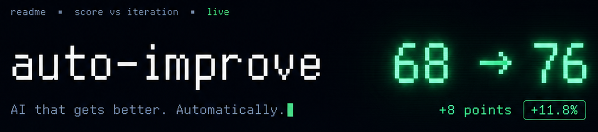
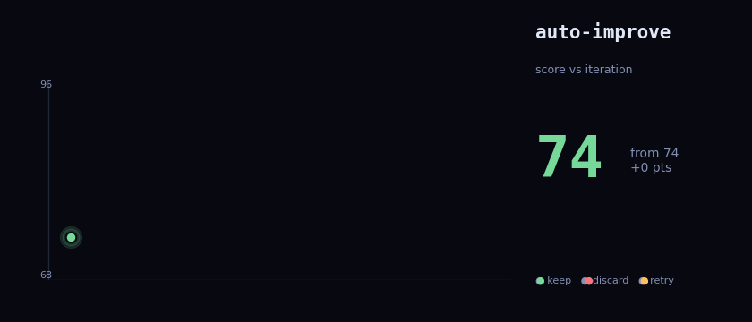

<p align="center">
  
</p>

# auto-improve

<p align="center">
  <a href="LICENSE"></a>
  
  <a href="https://github.com/crimeacs/auto-improve/actions/workflows/ci.yml"></a>
  <a href=".github/CONTRIBUTING.md"></a>
  
</p>

**A GAN-style self-improvement loop for any text artifact.** Point it at a file —
**bring a rubric, or let auto-improve write one from the artifact.** It then mutates the
file, grades each candidate with a **strict, independent judge model**, then filters them through a **debiased pairwise gate** (where candidate and champion are evaluated head-to-head in shuffled orderings to eliminate position bias). It keeps only the changes that genuinely win, and reverts the rest. By evaluating candidate mutations against this strict double-blind filter, auto-improve eliminates the "LLM slop" of unverified rewrites. The git history becomes the improvement log — every commit is a verified gain.

Works on anything text: emails, landing pages, prompts, READMEs, API designs, configs,
blog posts, cover letters. Don't have a rubric? Pass a one-line `--goal` (or nothing) and
it infers the right criteria first. Inspired by Karpathy's [autoresearch](https://github.com/karpathy/autoresearch) — see [Lineage](#lineage).

```text
$ python3 improve.py --artifact examples/cold-email.txt \
                     --criteria criteria/cold-email-quality.md --tag email

[Baseline] Score: 48/100
[Iter 1] [KEEP] specific hook beats the generic opener        48 -> 52
[Iter 2] [KEEP] concrete metric replaces "does a lot"         52 -> 56
[DONE] email: 48 -> 56
```

**Before** → *"I wanted to reach out because I think our product could really help your
team. We've built an AI tool that does a lot of things…"*
**After** → *"I saw your engineering team is scaling up deployment velocity this quarter,
which usually strains QA. We cut regression cycles from 12 hours to under 15 minutes…"*

---

## Why it's different

The trap with "ask an LLM to improve this" is **slop**: the model rewrites confidently
and you can't tell if it actually got better. auto-improve fixes that with two rules:

1. **A separate judge.** The model that *mutates* never *grades* — grading is a fresh
   call against your rubric, so it can't grade its own homework.
2. **A pairwise keep/discard gate.** Each candidate is evaluated head-to-head against the current champion. To eliminate position bias (where LLMs favor the first option), the judge evaluates two shuffled prompts in parallel: `[Candidate, Champion]` and `[Champion, Candidate]`. A mutation is **kept only if it wins both evaluations** (a strict 2-0 sweep). Confident-but-worse rewrites get reverted, not shipped.

The result is a monotonic climb you can trust — and a git branch where every commit is
a real improvement, fully diffable.

## How it works

```
for each iteration:
  MUTATE   → ask the model for N candidate edits (best-of-N), applied as surgical diffs
  SCORE    → grade each candidate against the rubric (parallel, separate model)
  DECIDE   → pairwise-judge the best candidate vs. the champion; keep iff it wins
  COMMIT   → git-commit a keep (advance the branch) / discard the rest
```

- **Surgical diffs, not rewrites** — a crash-proof apply ladder (exact → unicode-canon
  → fuzzy) means a malformed edit is skipped, never corrupts the file. If an LLM-proposed patch fails to apply or corrupts syntax, the diff engine catches the exception, logs the failure, discards the malformed candidate, and falls back to evaluating the remaining intact candidates in the Best-of-N pool.
- **Best-of-N** — N candidates per round, so one bad draw doesn't stall the climb.
- **The git history is the artifact** — `git log improve/<tag>` is your improvement trail.

## Install

```bash
git clone https://github.com/crimeacs/auto-improve && cd auto-improve
pip install requests
export GEMINI_API_KEY=...        # free key: https://aistudio.google.com/apikey
```

Python 3.9+. One dependency (`requests`). Uses Google Gemini by default.

## Quickstart

Run it on the bundled example (a weak cold email + a rubric):

```bash
python3 improve.py --artifact examples/cold-email.txt \
                   --criteria criteria/cold-email-quality.md --tag email
git log --oneline improve/email          # the improvement trail
git diff main improve/email -- examples/cold-email.txt
```

Or skip the rubric entirely — describe the goal and it writes the criteria first:

```bash
python3 improve.py --artifact path/to/your/file.md --tag v1 \
                   --goal "a landing hero that makes a developer try the product"
# → [Rubric] inferred from the artifact (saved to results/v1.rubric.md), then it climbs
```

> The artifact must live inside a **git repo** — that's how keeps and discards are
> checkpointed. Run from your project root.

## Usage

```
improve.py --artifact FILE --tag NAME [--criteria RUBRIC.md] [options]

  --artifact        file to improve (inside a git repo)
  --criteria        markdown rubric, dimensions totaling 100 (see criteria/).
                    OPTIONAL — omit it and a rubric is inferred from the artifact.
  --goal            one-line intent to steer the auto-generated rubric (optional)
  --tag             run id → git branch improve/<tag>, results/<tag>.tsv
  --max-iterations  default 10
  --candidates      candidate edits per round (best-of-N), default 3
  --eval-runs       eval passes averaged per candidate, default 2 (1 = faster)
  --threshold       stop when the score reaches this, default 90
  --status          show a finished run's results table
```

## The rubric (optional)

The rubric is the spec auto-improve optimizes against. You don't have to write one —
omit `--criteria` and it infers a rubric from the artifact first (steer it with
`--goal`, and inspect the result it saves to `results/<tag>.rubric.md`). **Bring your
own when you want control**: a rubric is a markdown file with weighted dimensions that
sum to 100. See [`criteria/README.md`](criteria/README.md) for the full guide and
[`criteria/cold-email-quality.md`](criteria/cold-email-quality.md) for a worked example.

```markdown
# <Artifact> — Quality Criteria
Anchors: 50 = average, 70 = good, 90+ = exceptional. Reward craft, not length.

## Dimensions (total: 100)
### <Dimension> (N points)
- <what earns the points> (0-X)
```

## Going further

The loop is more general than "improve one file":

- **Improve the artifact, or the generator that makes it.** Point `--artifact` at the
  *output* (a draft, a landing page) — or at the *thing that produces it*: a prompt
  template, a function, a config. Improving the generator compounds, because every
  artifact it produces next starts better.
- **When it plateaus, improve the rubric.** A rubric is just text, so run auto-improve on
  it too — tighten vague dimensions, fix mis-weighted points, then re-run the artifact
  against the sharper rubric. The improver and the spec climb in turns.
- **Source the rubric instead of writing it.** Infer it from the artifact (`--goal`), or
  extract one from a style guide, a spec, or a book — anything that encodes "what good
  looks like" can become the bar.

It won't take a weak idea "to the moon," but it reliably grinds down the obvious slop and
the clearly-worse choices — automatically, and every step stays a verified gain.

## Bundled examples

Runnable examples — point `--artifact`/`--criteria` at a pair and watch it climb:

| artifact | rubric | |
|---|---|---|
| `examples/cold-email.txt` | `criteria/cold-email-quality.md` | |
| `examples/blog-post.md`   | `criteria/blog-post-quality.md` | |
| `examples/prompt.txt`     | `criteria/prompt-quality.md` | |
| `examples/api-design.py`  | `criteria/api-design-quality.md` | ← the hard one: a footgun-ridden function interface → a clean, hard-to-misuse API |

## Voice notes — improve spoken *delivery*

The same loop applied to how a note *sounds*, not just the words: it mutates the
text-to-speech voice + settings (and inline emotion tags), renders a clip, and an
**audio model** scores it — keeping the takes that genuinely sound better. See
[`voice/`](voice/) (needs an ElevenLabs key). Run it alongside the text loop for a note
that reads well *and* lands when spoken.

## Watch it climb (Rust plot)

A tiny [macroquad](https://macroquad.rs) app in [`plot/`](plot/) renders a run **live** —
score vs iteration, green keeps / red resets / gold retries — and re-reads the TSV as the
loop runs, so you watch the climb build in real time.

<p align="center">
  
</p>

```bash
cd plot && cargo build --release
./target/release/plot ../results/<tag>.tsv     # or pass a dir to auto-pick the latest run
```

Run `improve.py` in one terminal and the plot in another to watch it climb. Headless check
(no window): `./target/release/plot --dump ../results/<tag>.tsv`.

## Configuration

| env var | default | purpose |
|---|---|---|
| `GEMINI_API_KEY` / `GOOGLE_API_KEY` | — | **required** |
| `IMPROVE_MUTATOR` | `gemini-flash-latest` | model that proposes edits |
| `IMPROVE_EVALUATOR` | `gemini-flash-latest` | model that grades + judges |
| `RESULTS_DIR` | `./results` | where `<tag>.tsv` climb logs are written |
| `IMPROVE_EVENTS_LOG` | — | optional path to append run events as JSONL |

## Lineage

auto-improve sits where three ideas meet:

- **[karpathy/autoresearch](https://github.com/karpathy/autoresearch)** — the direct
  inspiration: an LLM proposing edits and judging its own work in a loop.
- **GANs** ([Goodfellow et al., 2014](https://arxiv.org/abs/1406.2661)) — a *generator*
  (the mutator) and a *discriminator* (the separate judge) held in tension: the mutator
  tries to produce changes the judge will accept, the judge keeps it honest. Here the
  trained artifact isn't a network — it's the git branch.
- **RL from AI feedback** ([RLAIF, Lee et al., 2023](https://arxiv.org/abs/2309.00267)) —
  read each iteration as one policy-improvement step whose reward is an *AI judge's*
  pairwise preference rather than a human's. The keep/discard gate is the reward model;
  "keep iff it wins" is the update.

## License

MIT — see [LICENSE](LICENSE).
