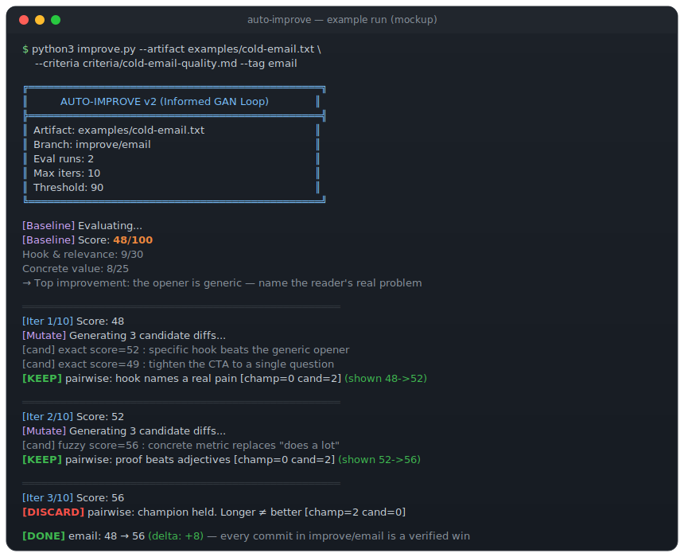

<p align="center">
  
</p>

# auto-improve

<p align="center">
  <a href="README.md">English</a> | <b>Русский</b>
</p>

<p align="center">
  <a href="LICENSE"></a>
  
  <a href="https://github.com/crimeacs/auto-improve/actions/workflows/ci.yml"></a>
  <a href=".github/CONTRIBUTING.md"></a>
  
</p>

**Цикл самоулучшения в стиле GAN для любого текстового артефакта.** Укажите файл —
**принесите рубрику или позвольте auto-improve вывести её из самого артефакта.** Дальше
цикл мутирует файл, оценивает каждого кандидата **строгой, независимой моделью-судьёй**
и пропускает их через **дебиасированный парный гейт**: кандидат и текущий чемпион
сравниваются лицом к лицу в перемешанном порядке, чтобы исключить позиционное смещение.
Остаются только изменения, которые действительно побеждают; остальное откатывается.
Такой строгий двойной слепой фильтр убирает «LLM-слоп» непроверенных переписываний.
История git становится журналом улучшений — каждый коммит — это проверенный выигрыш.

Работает с любым текстом: письма, лендинги, промпты, README, дизайн API, конфиги,
посты, сопроводительные письма. Нет рубрики? Передайте однострочный `--goal` (или
ничего) — сначала будут выведены подходящие критерии. Вдохновлено
[autoresearch](https://github.com/karpathy/autoresearch) Карпатого — см. [Родословную](#родословная).

<p align="center">
  
</p>

<p align="center"><sub><i>Мокап-скриншот типичного запуска: базовая оценка → проверенные KEEP-шаги → откат слабого кандидата → итоговый прирост.</i></sub></p>

**До** → *«Пишу вам, потому что думаю, что наш продукт может очень помочь вашей
команде. Мы сделали ИИ-инструмент, который умеет много всего…»*
**После** → *«Увидел, что ваша инженерная команда в этом квартале ускоряет деплой —
обычно это бьёт по QA. Мы сократили цикл регрессии с 12 часов до 15 минут…»*

---

## Чем это отличается

Ловушка подхода «попроси LLM улучшить текст» — **слоп**: модель уверенно переписывает,
а стало ли лучше — непонятно. auto-improve чинит это двумя правилами:

1. **Отдельный судья.** Модель, которая *мутирует*, никогда не *оценивает* — оценка
   идёт свежим вызовом по вашей рубрике, так что она не проверяет собственную
   домашнюю работу.
2. **Парный гейт keep/discard.** Каждый кандидат сравнивается лицом к лицу с текущим
   чемпионом. Чтобы исключить позиционное смещение (LLM склонны предпочитать первый
   вариант), судья параллельно оценивает две перемешанные пары: `[Кандидат, Чемпион]`
   и `[Чемпион, Кандидат]`. Мутация **остаётся, только если выигрывает обе оценки**
   (строгий счёт 2-0). Уверенные-но-худшие переписывания откатываются, а не уезжают
   в прод.

Результат — монотонный подъём, которому можно доверять, и git-ветка, где каждый
коммит — реальное улучшение, полностью просматриваемое через diff.

## Как это работает

```
на каждой итерации:
  MUTATE   → модель предлагает N кандидатов-правок (best-of-N), точечные диффы
  SCORE    → каждый кандидат оценивается по рубрике (параллельно, отдельной моделью)
  DECIDE   → лучший кандидат сравнивается с чемпионом попарно; остаётся, только если победил
  COMMIT   → keep коммитится в git (ветка продвигается) / остальное отбрасывается
```

- **Точечные диффы, а не переписывания** — «лестница применения» (точное совпадение →
  юникод-канонизация → fuzzy) не даёт сломать файл: некорректная правка пропускается,
  а не портит артефакт. Если предложенный LLM патч не применяется или ломает синтаксис,
  движок ловит исключение, логирует сбой, отбрасывает кандидата и продолжает с
  оставшимися целыми кандидатами из пула best-of-N.
- **Best-of-N** — N кандидатов на раунд, одна неудачная попытка не останавливает подъём.
- **История git — и есть артефакт** — `git log improve/<tag>` — ваш след улучшений.

## Установка

```bash
git clone https://github.com/crimeacs/auto-improve && cd auto-improve
pip install requests
export GEMINI_API_KEY=...        # бесплатный ключ: https://aistudio.google.com/apikey
```

Python 3.9+. Одна зависимость (`requests`). По умолчанию используется Google Gemini.

## Быстрый старт

Запустите на встроенном примере (слабое холодное письмо + рубрика):

```bash
python3 improve.py --artifact examples/cold-email.txt \
                   --criteria criteria/cold-email-quality.md --tag email
git log --oneline improve/email          # след улучшений
git diff main improve/email -- examples/cold-email.txt
```

Или вовсе без рубрики — опишите цель, и критерии будут написаны автоматически:

```bash
python3 improve.py --artifact path/to/your/file.md --tag v1 \
                   --goal "хиро лендинга, после которого разработчик попробует продукт"
# → [Rubric] выводится из артефакта (сохраняется в results/v1.rubric.md), затем начинается подъём
```

> Артефакт должен лежать внутри **git-репозитория** — так фиксируются keep и discard.
> Запускайте из корня проекта.

## Использование

```
improve.py --artifact FILE --tag NAME [--criteria RUBRIC.md] [опции]

  --artifact        файл для улучшения (внутри git-репозитория)
  --criteria        markdown-рубрика, измерения в сумме дают 100 (см. criteria/).
                    НЕОБЯЗАТЕЛЬНО — без неё рубрика выводится из артефакта.
  --goal            однострочная цель, направляющая автогенерацию рубрики (опционально)
  --tag             id запуска → git-ветка improve/<tag>, results/<tag>.tsv
  --max-iterations  по умолчанию 10
  --candidates      кандидатов-правок на раунд (best-of-N), по умолчанию 3
  --eval-runs       прогонов оценки на кандидата (усредняются), по умолчанию 2 (1 = быстрее)
  --threshold       остановиться при достижении этой оценки, по умолчанию 90
  --status          показать таблицу результатов завершённого запуска
```

## Рубрика (необязательна)

Рубрика — это спецификация, по которой auto-improve оптимизирует. Писать её не
обязательно — опустите `--criteria`, и рубрика будет выведена из артефакта
(направьте процесс через `--goal`, результат сохраняется в `results/<tag>.rubric.md`).
**Приносите свою, когда нужен контроль**: рубрика — это markdown-файл со взвешенными
измерениями, дающими в сумме 100. Полный гид — в [`criteria/README.md`](criteria/README.md),
разобранный пример — в [`criteria/cold-email-quality.md`](criteria/cold-email-quality.md).

```markdown
# <Артефакт> — Критерии качества
Якоря: 50 = средне, 70 = хорошо, 90+ = исключительно. Награждайте мастерство, а не длину.

## Измерения (всего: 100)
### <Измерение> (N баллов)
- <за что начисляются баллы> (0-X)
```

## Дальше — больше

Цикл более общий, чем «улучшить один файл»:

- **Улучшайте артефакт — или генератор, который его производит.** Направьте
  `--artifact` на *выход* (черновик, лендинг) — или на *то, что его порождает*:
  шаблон промпта, функцию, конфиг. Улучшение генератора даёт сложный процент: каждый
  следующий артефакт стартует лучше.
- **Вышли на плато — улучшайте рубрику.** Рубрика — это просто текст, так что
  прогоните auto-improve и по ней: подтяните расплывчатые измерения, поправьте веса,
  затем прогоните артефакт по обострённой рубрике. Улучшатель и спецификация
  поднимаются по очереди.
- **Добывайте рубрику, а не пишите её.** Выведите её из артефакта (`--goal`) или
  извлеките из стайлгайда, спеки, книги — всё, что кодирует «как выглядит хорошо»,
  может стать планкой.

Слабую идею «на луну» цикл не унесёт, но он надёжно стачивает очевидный слоп и
явно худшие решения — автоматически, и каждый шаг остаётся проверенным выигрышем.

## Встроенные примеры

Готовые к запуску пары — укажите `--artifact`/`--criteria` и смотрите на подъём:

| артефакт | рубрика | |
|---|---|---|
| `examples/cold-email.txt` | `criteria/cold-email-quality.md` | |
| `examples/blog-post.md`   | `criteria/blog-post-quality.md` | |
| `examples/prompt.txt`     | `criteria/prompt-quality.md` | |
| `examples/api-design.py`  | `criteria/api-design-quality.md` | ← сложный случай: интерфейс-минное-поле → чистый, защищённый от неверного использования API |

## Голосовые заметки — улучшение *звучания*

Тот же цикл, применённый к тому, как заметка *звучит*, а не только к словам: мутируются
голос и настройки text-to-speech (плюс инлайн-теги эмоций), рендерится клип, и
**аудиомодель** оценивает его — остаются дубли, которые действительно звучат лучше.
См. [`voice/`](voice/) (нужен ключ ElevenLabs). Запускайте вместе с текстовым циклом,
чтобы заметка и читалась, и звучала.

## Смотрите на подъём вживую (Rust-график)

Крошечное [macroquad](https://macroquad.rs)-приложение в [`plot/`](plot/) рисует запуск
**вживую** — оценка по итерациям, зелёные keep / красные reset / золотые retry — и
перечитывает TSV по ходу цикла, так что подъём строится у вас на глазах.

<p align="center">
  
</p>

```bash
cd plot && cargo build --release
./target/release/plot ../results/<tag>.tsv     # или передайте каталог — подхватит свежайший запуск
```

Запустите `improve.py` в одном терминале и график в другом. Headless-проверка
(без окна): `./target/release/plot --dump ../results/<tag>.tsv`.

## Конфигурация

| переменная окружения | по умолчанию | назначение |
|---|---|---|
| `GEMINI_API_KEY` / `GOOGLE_API_KEY` | — | **обязательна** |
| `IMPROVE_MUTATOR` | `gemini-flash-latest` | модель, предлагающая правки |
| `IMPROVE_EVALUATOR` | `gemini-flash-latest` | модель, которая оценивает и судит |
| `RESULTS_DIR` | `./results` | куда пишутся логи подъёма `<tag>.tsv` |
| `IMPROVE_EVENTS_LOG` | — | необязательный путь для JSONL-событий запуска |

## Родословная

auto-improve стоит на пересечении трёх идей:

- **[karpathy/autoresearch](https://github.com/karpathy/autoresearch)** — прямое
  вдохновение: LLM предлагает правки и судит собственную работу в цикле.
- **GAN** ([Goodfellow et al., 2014](https://arxiv.org/abs/1406.2661)) — *генератор*
  (мутатор) и *дискриминатор* (отдельный судья) в напряжении: мутатор пытается
  произвести изменения, которые судья примет, судья держит его честным. Только
  обучаемый артефакт здесь не сеть, а git-ветка.
- **RL from AI feedback** ([RLAIF, Lee et al., 2023](https://arxiv.org/abs/2309.00267)) —
  читайте каждую итерацию как один шаг policy improvement, где награда — парное
  предпочтение *ИИ-судьи*, а не человека. Гейт keep/discard — это reward-модель;
  «оставить, только если победил» — это update.

## Лицензия

MIT — см. [LICENSE](LICENSE).
